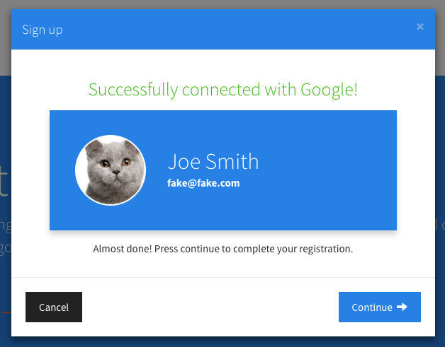
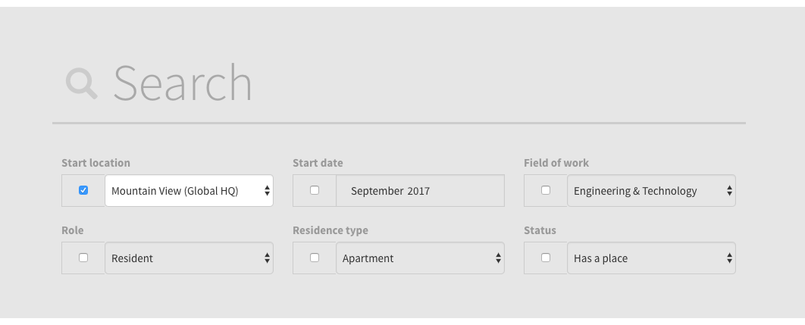

# roomM8
by Soeren Walls

**roomM8** is a place for Nooglers to find roommates. It's a Heroku web app built with `NodeJS`, `Bootstrap`, `ExpressJS`, `MongoDB`, and `AngularJS`. roomM8 was built by [a Noogler](http://www.soerenwalls.com/) for other Nooglers.  It is a completely independent service that has no association with Google.

> [https://roomm8.io](https://roomm8.io)

## What's it for?
The purpose of roomM8 is to provide a **secure** and **searchable** database of people who will be working at Google soon and are looking for roommates. Roommates are great for several reasons:

1. Someone to talk to besides yourself
2. Someone to relate to about being new at Google
3. Someone to watch Game of Thrones with
4. Cheaper rent

## Using roomM8

### What happens when I sign up?
When you sign up for roomM8, you'll enter some Google-specific information like where & when you will be starting at Google, as well as some practical information like how many roommates you're looking for and how important quiet time & cleanliness are to you.



After you sign up, you'll have access to the entire database of other Nooglers who have already signed up. You can easily search for people by name, field of work, Google Campus location, start date, and more. You can see what cities they're considering living in, how many roommates they want, what type of residence they want, and more.



### How can I trust roomM8?
This service uses secure protocols (`https`, `express`), authentication (`passport`, `redis`, `google-oauth`), and data storage (`mongodb`, `mongoose`) which you can verify by viewing the complete source code right here. I'm not perfect, so if you see anything problematic, pull requests or new issues are more than welcome!

### Privacy/safety concerns?
Other users will be able to see your name, photo (if you have one), and other relevant information. However, you can choose to keep your age and gender private, and your email address is always kept private. Messages you recieve on roomM8 will be forwarded to your email, but the sender won't know your email unless you reply. Also, **users can only message another user once**. This is to prevent your inbox from blowing up.

Unless a Noogler shares the secret registration code with a non-Noogler (if you do, [shame on you!](http://i.imgur.com/NAJE0d0.png)), every user of roomM8 is a Google employee. If you believe in Google's hiring practices, this means it's a relatively trustworthy group of people.

That being said, you should of course always be cautious when talking to anyone online. If you get a message that seems fishy/sketchy, just ignore it. If you become suspicious that someone might not be a Noogler, ask for proof. **If you are harassed or believe someone is abusing the service, please report them immediately.** Ultimately, however, roomM8's creator cannot be held responsible for anything bad that happens.

### Can I temporarily hide my profile?
Yes. If at any time you wish to stop receiving messages from other users and temporarily hide
your profile from the public listing, just click the 'Hide profile' button. To unhide
your profile, click the 'Show profile' button.

### Can I delete my account?
Yes. Once you're done using roomM8, hopefully after you've found a fantastic roommate, it's very easy to delete your account and permenantly erase all your info from the database. This action cannot be undone.

## Deploying roomM8

Want to deploy your own copy of roomM8?

You will need:
* A [Heroku](https://heroku.com/) dyno (can be local)
* A [Redis Cloud](https://devcenter.heroku.com/articles/rediscloud) database to store persistent user sessions
* A [MongoDB](https://mlab.com/) database to store user account data.
* A [Google Cloud Platform](https://console.cloud.google.com/) project with an OAuth 2.0 client ID

### How to deploy

1. Run `git clone` or download the source code
2. Run `npm install` in root directory to install dependencies
3. Download heroku CLI and run `heroku create`
4. `git push heroku master`
5. Set heroku config vars specified in [`config/auth.js`](config/auth.js)

If your Heroku dyno is online, the config vars can be set in your Heroku app dashboard. Otherwise, if it's a local dyno, make a new file called `.env` in the root folder. Be sure to keep this file private (**never** commit it to a git repository), as it will contain highly sensitive information. Here is what the `.env` file should contain:

```
SESSION_SECRET='some_random_long_string' # You set this
SECRET_KEY='the_secret_code_for_signing_up' # You set this
GOOGLE_CLIENT_ID='xxx.apps.googleusercontent.com' # Get this from Google Cloud Platform API dashboard
GOOGLE_CLIENT_SECRET='yyy' # Get this from Google Cloud Platform API dashboard
GOOGLE_CALLBACK_URL='http://localhost:5000/auth/google/callback' # Must match value in Google Cloud Platform API dashboard
MONGO_DB_URL='mongodb://<user>:<pass>@<host>:<port>/<db>' # Get this from MongoDB server
REDISCLOUD_URL='redis://rediscloud:<host>:<port>' # Get this from Redis Cloud account
USE_SECURE_COOKIES=true # You set this
NODEMAILER_TRANSPORT='smtps://<your_support_email>%40gmail.com:<pass>@smtp.gmail.com' # Doesn't have to be gmail
FORCE_SSL=true # You set this
```

## License

   Copyright 2017 Soeren Walls

   Licensed under the Apache License, Version 2.0 (the "License");
   you may not use this file except in compliance with the License.
   You may obtain a copy of the License at

       http://www.apache.org/licenses/LICENSE-2.0

   Unless required by applicable law or agreed to in writing, software
   distributed under the License is distributed on an "AS IS" BASIS,
   WITHOUT WARRANTIES OR CONDITIONS OF ANY KIND, either express or implied.
   See the License for the specific language governing permissions and
   limitations under the License.